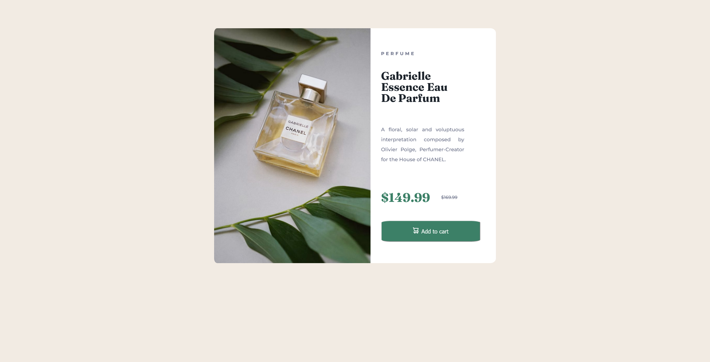

# Frontend Mentor - Product preview card component solution

This is a solution to the [Product preview card component challenge on Frontend Mentor](https://www.frontendmentor.io/challenges/product-preview-card-component-GO7UmttRfa). Frontend Mentor challenges help you improve your coding skills by building realistic projects. 

## Table of contents

- [Overview](#overview)
  - [The challenge](#the-challenge)
  - [Screenshot](#screenshot)
  - [Links](#links)
- [My process](#my-process)
  - [Built with](#built-with)
  - [What I learned](#what-i-learned)
  - [Continued development](#continued-development)
  - [Useful resources](#useful-resources)
- [Author](#author)

**Note: Delete this note and update the table of contents based on what sections you keep.**

## Overview

### The challenge

Users should be able to:

- View the optimal layout depending on their device's screen size
- See hover and focus states for interactive elements

### Screenshot




### Links

- Solution URL: [Add solution URL here](https://your-solution-url.com)
- Live Site URL: [Add live site URL here](https://your-live-site-url.com)

## My process

I started changing the color of body and atributes. Creating tags: main a figure and section.
Im main i styled the h1,h2,p, prices and button (only color and font).
Then i started to centralize horizontally the figure and section, soon after i
centralized the texts (flex-direction: colum;) and also the price (flex-direction: row;).
When everything was created i place some margins im some elements.
### Built with

- Semantic HTML5 markup
- CSS custom properties
- Flexbox

### What I learned

I learn more about inheritance, and how elements work with display: flex;.

```html
<article>
          <h2>PERFUME</h2>
          <h1>Gabrielle Essence Eau De Parfum</h1>
          <p> A floral, solar and voluptuous interpretation composed by Olivier Polge, Perfumer-Creator for the House of CHANEL.</p>
        </article>
        <div class="div-price">
          <h3 class="number-primary">$149.99</h3>
          <h4 class="number-secundary">$169.99</h4>
        </div>
```
```css
.proud-of-this-css {
  figure img{
    width: 100%;
    height: 100%;
    border-top-left-radius: 2%;
    border-bottom-left-radius: 2%;
}
```

### Continued development

The project is not done, last responsiveness and some other things.

### Useful resources

- [MDN](https://developer.mozilla.org/pt-BR/) - Here i learn about border radius and display flex.
- [Eric Meyer reset](https://meyerweb.com/eric/tools/css/reset/) - Good reset.

## Author

- Frontend Mentor - [@DropperDEV](https://www.frontendmentor.io/profile/DropperDEV)
- Github - [@DropperDEV](https://github.com/DropperDEV)